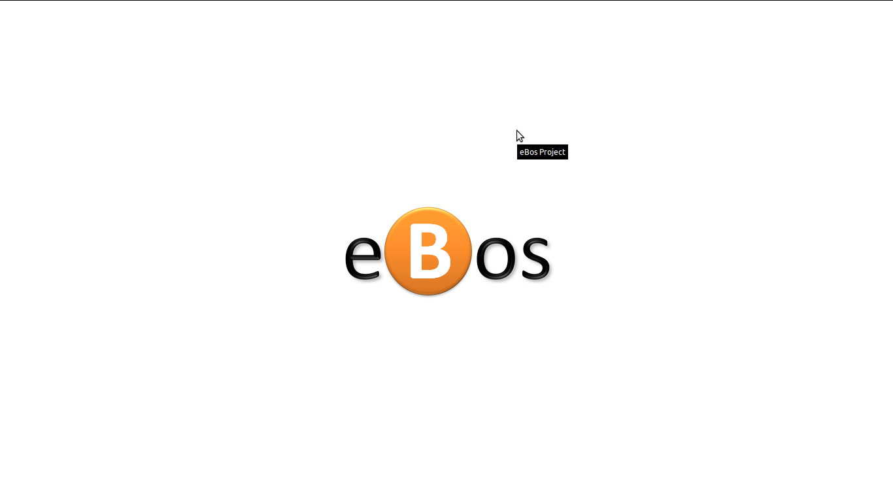
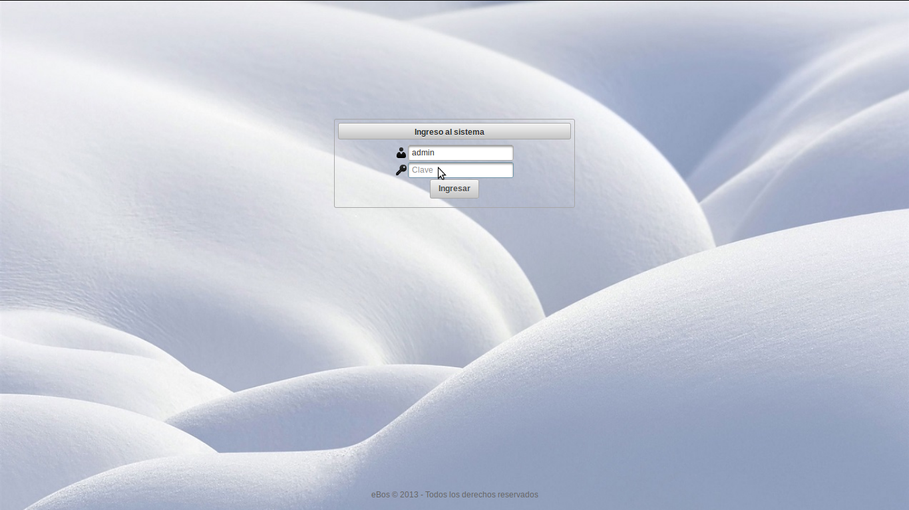
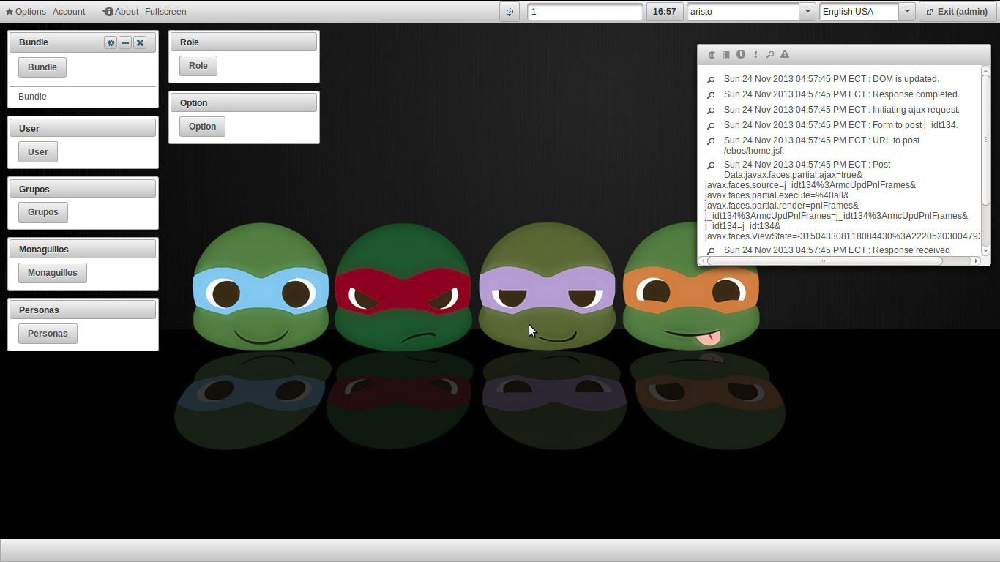
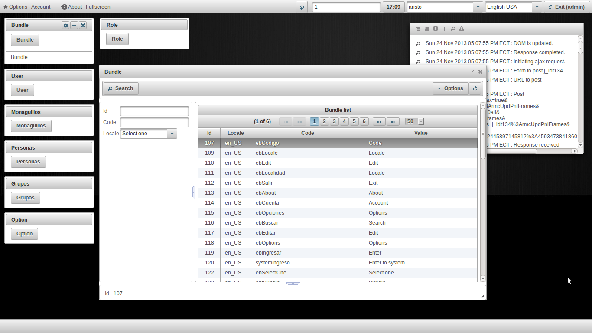
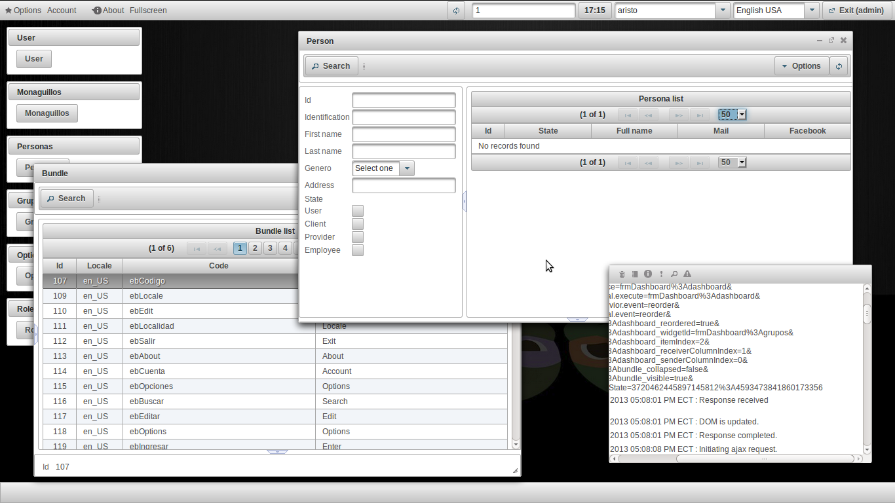
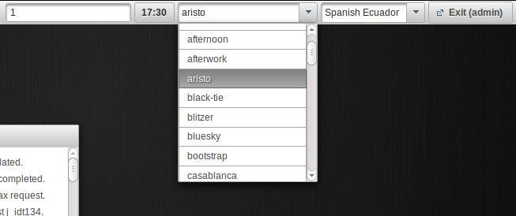
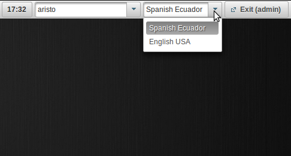
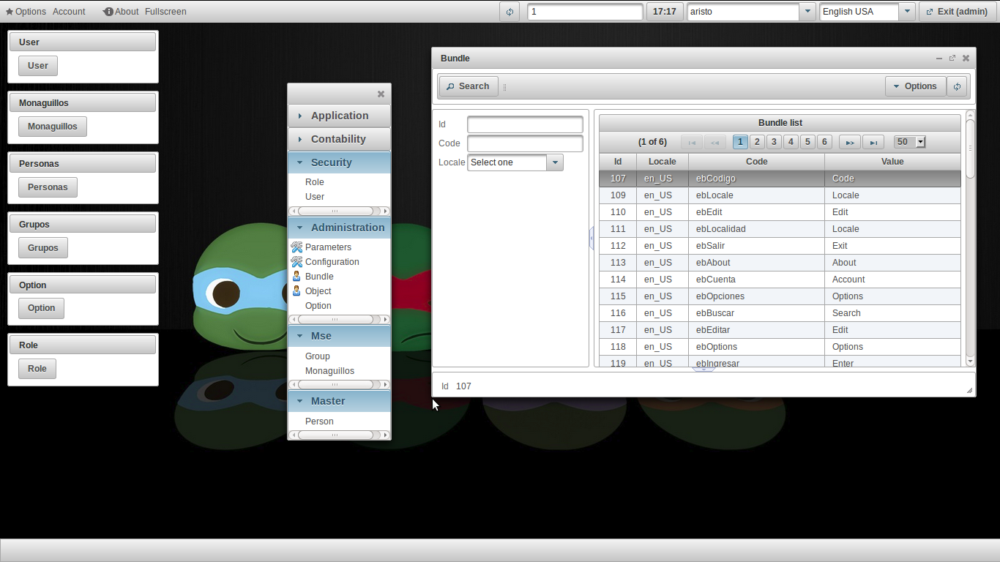
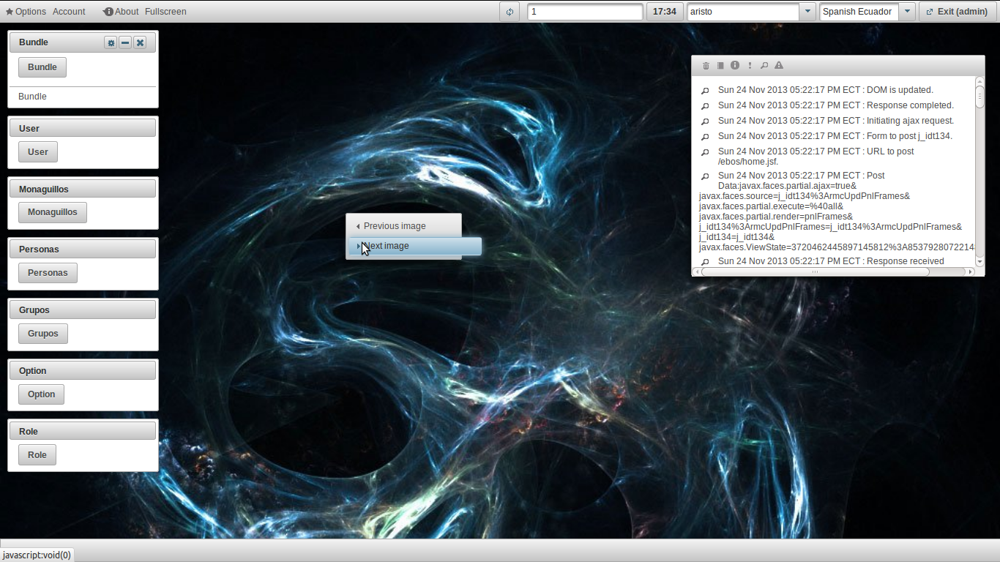

#		     eBos Project 3.0.3								

> Autor: Eduardo Plúa Alay							
> Nombre: eBos Project				
> Version: 3.0.3
> Publicación: 2013-11-24

## ¿Qué es?
__eBos Project__ Sistema de Operaciones Empresariales Ecuatoriano (__eBos__, por sus siglas en inglés), es una iniciativa open source para el desarrollo de una plataforma modular basada en OSGi y varios de los
frameworks java más robustos del mercado.

__eBos Project__ tiene como objetivo abstraer al desarrollador de la complejidad de una arquitectura de software del mundo real y permitirle así enfocarse
sólo en la lógíca del sistema a implementar.

__eBos Project__ implementa un concepto básico de lo que es un WebOS sin llegar a ser uno como tal.

## Capturas de pantalla

Página de bienvenida

Página de inicio de sesión

Escritorio

Ventanas

Multi ventanas

Multi temas 

 Multi lenguages 

 Menú de opciones

Imagen de fondo

Navegador interno

## Instalación

### Herramientas

#### STS
http://spring.io/tools/sts/all

#### VIRGO PLUGIN
http://wiki.eclipse.org/Virgo/Tooling

## Notas de versiones

### Version 3.3.0		2014-##-##

1. Diseño e implementación de un bundle de administración o panel de control
1.1. Configuración de opciones por módulos
1.2. Configuración de preferencias de usuario
1.3. Manejo de trazabilidad
1.4. Manejo de eventos o notificaciones
1.5. Manejo de accesos directos de opciones
1.5.1. Creación y administración de accesos de opciones desde el panel de control
1.5.2. Administración de accesos directos a través de un menú contextual único parametrizado para cada opción

### Version 3.2.0		2013-##-##

1. Rediseño de módulo de seguridad
1.1. El nuevo módulo debe permitir administrar los permisos del sistema en tiempo real

### Version 3.1.0		2013-##-##

1. Definición de módulo contable
1.1. Documentación de funcionalidades

2. Implementación de módulo contable

### Version 3.0.3		2013-##-##

1. Dividir ec.com.ebos.core bundle en capas:
	core
	hibernate
	
2. Optimizar spring xml entries en todos los bundles

3. Error al leer permisos de acciones para todas las opciones. No se renderizan los botones de acciones

### Version 3.0.2		2013-10-25

1. Dividir ec.com.ebos.core bundle en capas:
	core
	db

### Version 3.0.1		2013-10-24

1. Dividir ec.com.ebos.web bundle en capas:
	web
	core

### Version 3.0.0		2013-10-15

1. Migración eBos a OSGI 100% :)

2. Implementar plugin Maven Site

### Version 2.1.0		2013-09-04

1. Módulos
1.1. Mse(Monaguillos salecianos del Ecuador)

### Version 2.0.0		2013-05-27

1. Versión Web OS en marcha
1.1. Escritorio
1.2. Ventanas
1.3. About

2. Módulos
2.1. Seguridad

### Version 1.0.0		2013-04-08			

1. Versión con Tabs del sistema
